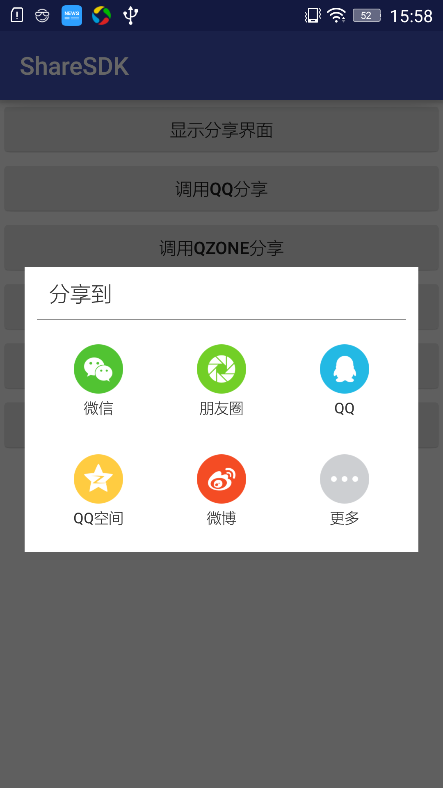

# ShareSDK
分享SDK，包括微信、朋友圈，微博，QQ，QQ空间等渠道分享。

# Gradle
    
    compile ('com.xyzlf.share:sharesdk:0.0.5') {
    	exclude group: 'com.android.support', module: 'appcompat-v7'
    }

# 效果图

# 使用方式

1、调用分享界面：

	public void showShareDialog() {
        ShareEntity testBean = new ShareEntity("我是标题", "我是内容，描述内容。");
        testBean.setUrl("https://www.baidu.com"); //分享链接
        testBean.setImgUrl("https://www.baidu.com/img/bd_logo1.png");
        ShareUtil.showShareDialog(getActivity(), testBean, ShareConstant.REQUEST_CODE);
    }

2、使用分享功能，如下实例 使用QQ分享功能：

	public void startShare() {
        ShareEntity testBean = new ShareEntity("我是标题", "我是内容，描述内容。");
        testBean.setUrl("https://www.baidu.com"); //分享链接
        testBean.setImgUrl("https://www.baidu.com/img/bd_logo1.png");
        ShareUtil.startShare(getActivity(), ShareConstant.SHARE_CHANNEL_QQ, testBean, ShareConstant.REQUEST_CODE);
    }

3、处理回调：

	@Override
    protected void onActivityResult(int requestCode, int resultCode, Intent data) {
        super.onActivityResult(requestCode, resultCode, data);
        /**
         * 分享回调处理
         */
        if (requestCode == ShareConstant.REQUEST_CODE) {
            if (data != null) {
                int channel = data.getIntExtra(ShareConstant.EXTRA_SHARE_CHANNEL, -1);
                int status = data.getIntExtra(ShareConstant.EXTRA_SHARE_STATUS, -1);
                onShareCallback(channel, status);
            }
        }
    }

详细使用说明，可以参照上面的使用说明文档。

# 更新日志

**0.0.5 支持本地图片分享**

ShareEntity testBean = new ShareEntity("我是标题", "我是内容，描述内容。");

1、本地drawable图片，使用方式：testBean.setDrawableId(R.drawable.icon);

2、本地手机SD卡图片，使用方式：testBean.setImgUrl("/sdpath/filepath/icon.png");

3、本地代码截屏Bitmap，使用方式：testBean.setBitmap(bitmap);

# 关于我
有任何使用问题，可以给我发邮件：

Author：张利峰

E-mail：519578280@qq.com

# License

    Copyright (C)  LessCode Open Source Project
    
    Licensed under the Apache License, Version 2.0 (the "License");
    you may not use this file except in compliance with the License.
    You may obtain a copy of the License at
    
    http://www.apache.org/licenses/LICENSE-2.0
    
    Unless required by applicable law or agreed to in writing, software
    distributed under the License is distributed on an "AS IS" BASIS,
    WITHOUT WARRANTIES OR CONDITIONS OF ANY KIND, either express or implied.
    See the License for the specific language governing permissions and
    limitations under the License.